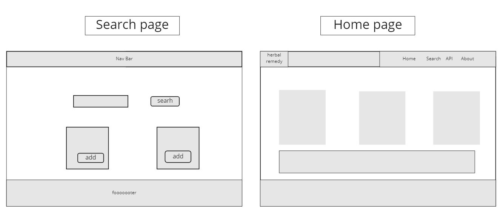
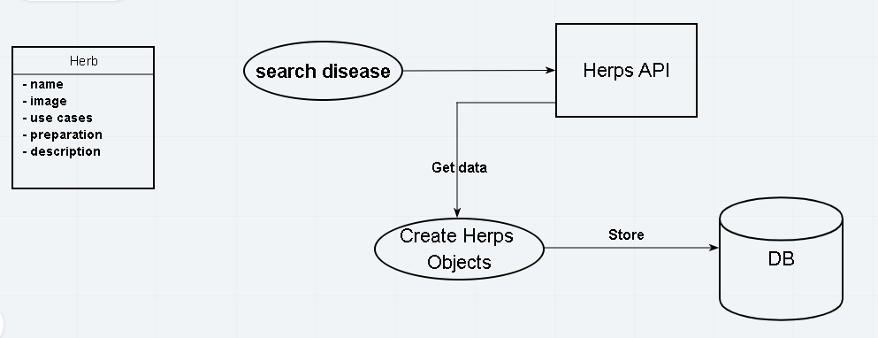

# Herbal Remedy

**Authors**
1. Mohammad Za'areer
2. Ghofran Dayyat
3. Qais Waleed 
4. Sara altaweel
5. mohammad al-khazali
 
**Version**: 1.0.0

## Overview
A website for natural herbal remedies, which are a basis of traditional medicine. User can describe him/her disease and get suitable herbs with all information that may help the patient for recovery.

## Getting Started
An updated version of any web browser with internet connection.

## Technologies
* HTML, CSS, JavaScript
* Node.js
* postgreSQL
* framworks: express
* npm packages: pg, superagent, method-override, cors, dotenv, ejs  

## Tools
* Windows 10
* Visual Studio Code
* Git & GitHub
* Windows Subsystem for Linux (WSL)

## license
[MIT License](LICENSE)

## Contents
```
├── data
│   ├── herbs.sql
│   └── seed.sql
├── package-lock.json
├── package.json
├── public
│   ├── img
│   ├── js
│   │   └── app.js
│   └── styles
│       ├── base.css
│       ├── layout.css
│       ├── modules.css
│       └── reset.css
├── server.js
└── views
    ├── layout
    │   ├── footer.ejs
    │   ├── head.ejs
    │   └── header.ejs
    └── pages
        ├── error.ejs
        ├── herbs
        │   ├── new.ejs
        │   └── show.ejs
        ├── index.ejs
        └── searches.ejs
            ├── new.ejs
            └── show.ejs
```
## database schema
|id|name|image_url|origin|description|
|--|----|---------|------|-----------|  

## Wireframes


## domain model


## Change Log
08-04-2021 6:20pm - Application now has a fully-functional express server. 

## Project Management Board
[User Stories](https://trello.com/b/GDHu5V5R/code301-project)

## Credits and Collaborations
* [code fellows academy](https://www.codefellows.org/)
* [stack overflow](https://stackoverflow.com/)
* [npm](https://www.npmjs.com/)
* [color hunt](https://colorhunt.co/)
* [Unspalsh](https://unsplash.com/)
